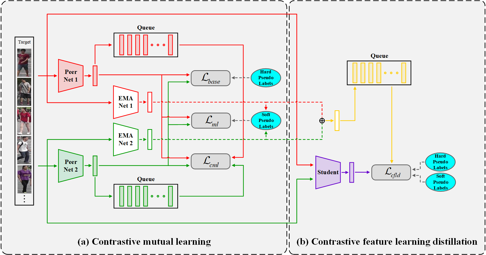
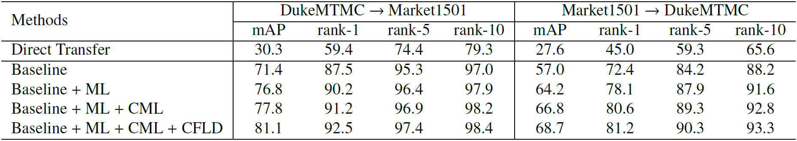
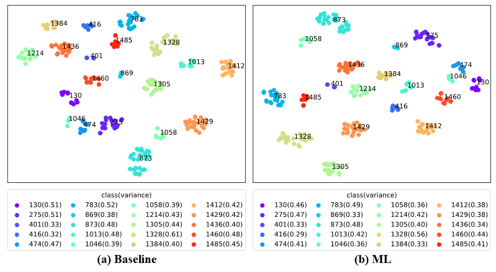
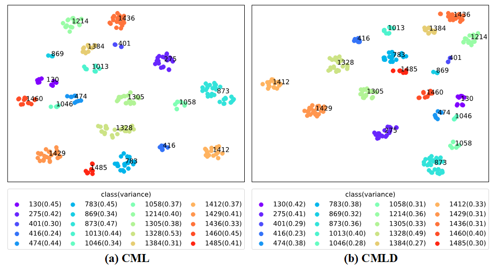
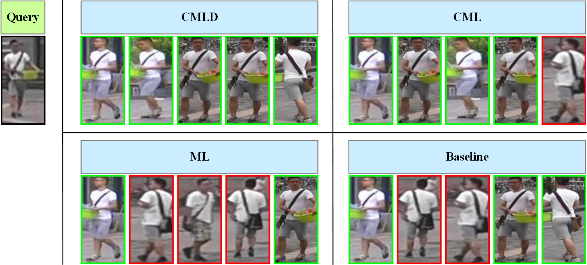

# Contrastive Mutual Learning Distillation (CMLD)

This repository presents the UDA person re-ID training method ***Contrastive Mutual Learning Distillation (CMLD)***, which is an improved method based on [MMT](https://arxiv.org/abs/2001.01526). Use the EMA models to generate more stable soft pseudo labels which are used to supervise peer models, and use mutual learning training manner to improve model performance. In addition, the contrastive learning method ***CML*** is used to improve the feature space distribution and make the output features of the model more discriminative, thereby improving the model performance. In order to further improve the performance of the model, the knowledge distillation method ***CFLD*** is used to transfer the prediction probability and feature representation knowledge of the teacher model to the student model.

<div align="center">

</div>

## Table of Contents

- [Getting Started](#getting-started)
  - [Prerequisites](#prerequisites)
  - [Installation](#installation)
  - [Datasets preparation](#datasets-preparation)
  - [ImageNet pre-trained weights preparation](#imagenet-pre-trained-weights-preparation)
- [Usage](#usage)
  - [Training](#training)
  - [Test](#test)
- [Effectiveness Analysis Experiments](#effectiveness-analysis-experiments)
  - [Ablation study](#ablation-study)
  - [t-SNE visualization](#t-sne-visualization)
  - [Rank-5 visualization](#rank-5-visualization)
- [License](#license)
- [Citation](#citation)
- [Acknowledgments](#acknowledgments)

## Getting Started
### Prerequisites

- Python 3.7.11 conda environment
- PyTorch 1.8.2 LTS with CUDA 11.1

### Installation

```bash
git clone https://github.com/ChienHsuan/CMLD.git
cd CMLD
pip install -r requirements.txt
```

### Datasets preparation

Download datasets [DukeMTMC-ReID](https://arxiv.org/abs/1609.01775), [Market1501](https://www.cv-foundation.org/openaccess/content_iccv_2015/papers/Zheng_Scalable_Person_Re-Identification_ICCV_2015_paper.pdf) and [MSMT17](https://arxiv.org/abs/1711.08565). Moreover, arrange the directory paths as follows:

```
/USER-DEFINED-PATH/Dataset/
                      ├── dukemtmc/
                      │       └── DukeMTMC-reID/
                      ├── market1501/
                      |       └── Market-1501-v15.09.15/
                      └── msmt17/
                              └── MSMT17_V1/
```

### ImageNet pre-trained weights preparation

Download the [ImageNet](https://image-net.org/) pre-trained weights of [IBN-ResNet](https://arxiv.org/abs/1807.09441) model from this [link](https://drive.google.com/drive/folders/1thS2B8UOSBi_cJX6zRy6YYRwz_nVFI_S) and arrange the model paths as follows:

```
CMLD/logs/
      └── pretrained/
              ├── resnet50_ibn_a.pth.tar
              └── resnet101_ibn_a.pth.tar
```

Download the ImageNet pre-trained weights of [OSNet-AIN](https://arxiv.org/abs/1910.06827) and [OSNet](https://arxiv.org/abs/1905.00953) models from this [link](https://kaiyangzhou.github.io/deep-person-reid/MODEL_ZOO.html#imagenet-pretrained-models), and these ImageNet pre-trained models are used for [deep-person-reid](https://github.com/ChienHsuan/deep-person-reid). Moreover, arrange the model paths as follows:

```
deep-person-reid/imagenet_pretrained_models/
                              ├── osnet_ain_x0_5_imagenet.pth
                              ├── osnet_ain_x1_0_imagenet.pth
                              ├── osnet_x0_5_imagenet.pth
                              └── osnet_x1_0_imagenet.pth
```

## Usage
### Training

The whole training process is divided into two stages: stage l and stage ll. In stage l, use ImageNet pre-trained models for pre-training on the source domain, so that the models can have basic person recognition ability. In stage ll, use the source domain pre-trained models to perform unsupervised learning on the target domain, and train the models by the proposed UDA training method ***CMLD***. Therefore, the source pre-trained models can be adapted to the target domain. The CMLD training architecture includes Baseline, ML, CML, and CFLD methods. Moreover, in order to verify the effectiveness of the CMLD architecture, the experiments with other related methods are also conducted to compare the pros and cons of the methods, including the contrastive learning and knowledge distillation methods.

#### Stage l: Source domain pre-training

Use [ResNet](https://arxiv.org/abs/1512.03385) and IBN-ResNet models for pre-training on the source domain, execute the command:

```bash
bash scripts\pretrain.sh
```

OSNet and OSNet-AIN models use [deep-person-reid](https://github.com/ChienHsuan/deep-person-reid) for source domain pre-training, execute the command:

```bash
bash train.sh
```

Change the dataset and model related arguments in training scripts as required.

Then arrange the paths of each source domain pre-training model in the following form:

```
/USER-DEFINED-PATH/models/
                      ├── dukemtmcTOmarket1501/
                      │           ├── resnet50-pretrain-0/
                      │           │           └── model_best.pth.tar
                      │           ├── resnet101-pretrain-0/
                      │           │           └── model_best.pth.tar
                      │           ├── resnet_ibn50a-pretrain-0/
                      │           │           └── model_best.pth.tar
                      │           └── resnet_ibn101a-pretrain-0/
                      │                       └── model_best.pth.tar
                      ├── market1501TOdukemtmc/...
                      ├── dukemtmcTOmsmt17/...
                      ├── market1501TOmsmt17/...
                      ├── osnet_ain_x0_5/
                      │          ├── dukemtmc/
                      │          │       ├── 0/
                      │          │       │    └── model.pth.tar-100
                      │          │       └── 1/
                      │          │            └── model.pth.tar-100
                      │          └── market1501/...
                      ├── osnet_ain_x1_0/...
                      ├── osnet_x0_5/...
                      └── osnet_x1_0/...
```

#### Stage ll: UDA training
##### 1. Baseline

Use only a single model for general clustering-based UDA training on the target domain.

```bash
bash scripts\cluster_base.sh
```

##### 2. ML

Use EMA models to generate more stable soft pseudo labels to supervise peer models, and use mutual learning method for training.

```bash
bash scripts\mutual_learning.sh
```

##### 3. CML

Use contrastive mutual learning (CML) methods based on ML methods to improve the output feature space distribution of the model. The objective function of contrastive learning is as follows.

$$
\mathcal L_{cont}(\theta) = - \frac{1}{PN_t} \sum_{j=1}^{P} \sum_{i=1}^{N_t} \left(\log \frac{S_{i,j}^+(\theta)}{S_{i,j}^+(\theta) + S_{i}^-(\theta)}\right)
$$

```bash
bash scripts\contrastive_ML.sh
```

##### 4. CFLD

Transfer the prediction probability and feature representation knowledge of the teacher model to the student model by Using the contrastive feature learning distillation (CFLD) method. Therefore, the student model has much lower model complexity and can achieve similar performance to the teacher model.

```bash
bash scripts\contrastive_ML_distillation.sh
```

##### Further improvement

Instead, use the improved contrastive learning objective function as follows, which will enable the model to achieve better performance.

$$
\mathcal L_{cont}(\theta) = - \frac{1}{PN_t} \sum_{j=1}^{P} \sum_{i=1}^{N_t} \left(\log \frac{S_{i,j}^+(\theta)}{S_{i,j}^+(\theta) + S_{i}^-(\theta)}\right) - \frac{1}{NN_t} \sum_{j=1}^{N} \sum_{i=1}^{N_t} \left(\log \left(1 - \frac{S_{i,j}^-(\theta)}{S_{i}^+(\theta) + S_{i,j}^-(\theta)}\right) \right)
$$

```bash
bash scripts\imp_contrastive_ML_distillation.sh
```

##### Method comparisons
###### 1. Contrastive learning method comparisons

Contrastive learning comparison methods are [MoCo](https://arxiv.org/abs/1911.05722) and [CAP](https://arxiv.org/abs/2012.10674), which can be changed with the `--cl-method` argument (`"moco"` and `"cap"`).

```bash
bash scripts\cl_comparison.sh
```

###### 2. Knowledge distillation method comparisons

Knowledge distillation comparison methods are [KD](https://arxiv.org/abs/1503.02531) and [CRD](https://arxiv.org/abs/1910.10699), which can be changed with the `--kd-method` argument (`"kd"` and `"crd"`).

```bash
bash scripts\kd_comparison.sh
```

Change the dataset and model related arguments in training scripts as required.

### Test

Use evaluation metrics **mean Average Precision (mAP)** and **Cumulative Matching Characteristics (CMC)** to evaluate the identification accuracy of person re-ID models.

```bash
bash scripts\test_model.sh
```

Change the dataset and model related arguments in test scripts as required.

## Effectiveness Analysis Experiments

The following are experiment results using the ResNet-50 model.

### Ablation study

<div align="center">

</div>

### t-SNE visualization

Dukemtmc &rarr; Market1501 experiment results:

<div align="center">

</div>

<div align="center">

</div>

### Rank-5 visualization

Dukemtmc &rarr; Market1501 experiment results:

<div align="center">

</div>

For more details, please refer to [*Person re-identification and tracking for multiple embedded edge cameras*](https://hdl.handle.net/11296/8vzvt2).

## License

The MIT License (MIT)  
Copyright (c) 2022 Chien-Hsuan Yen

## Citation

```
@mastersthesis{yen2022person,
    author = {Yen, Chien-Hsuan},
    title = {Person re-identification and tracking for multiple embedded edge cameras},
    type = {M.S. thesis},
    institution = {Dept. of Elect. Eng., Natl. Taipei Univ. of Tech.},
    location = {Taipei, Taiwan},
    year = {2022},
    url = {https://hdl.handle.net/11296/8vzvt2}
}
```

## Acknowledgments

[MMT](https://github.com/yxgeee/MMT)  
[deep-person-reid](https://github.com/KaiyangZhou/deep-person-reid)  
[MoCo](https://github.com/facebookresearch/moco)  
[CAP](https://github.com/Terminator8758/CAP-master)  
[CRD](https://github.com/HobbitLong/RepDistiller)  
