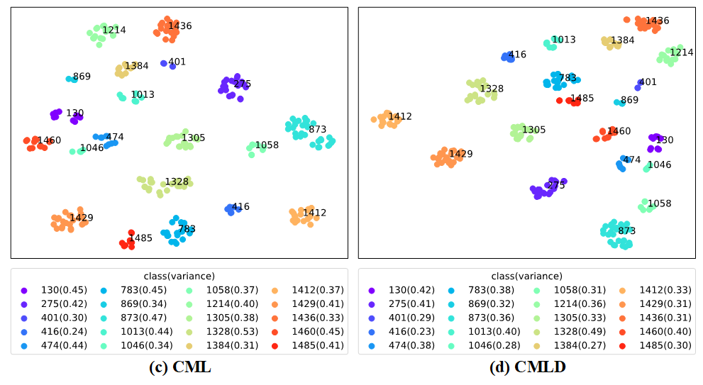

# Contrastive Mutual Learning Distillation (CMLD)

<div align="center">

</div>

## Table of Contents
- [Getting Started](#getting-started)
  - [Prerequisites](#prerequisites)
  - [Installation](#installation)
  - [Datasets preparation](#datasets-preparation)
  - [ImageNet pre-trained weights preparation](#imagenet-pre-trained-weights-preparation)
- [Usage](#usage)
  - [Training](#training)
  - [Test](#test)
- [Effectiveness Experiment Analysis](#effectiveness-experiment-analysis)
- [License](#license)
- [Citation](#citation)
- [Acknowledgments](#acknowledgments)

## Getting Started
### Prerequisites
- Python 3.7.11 conda environment
- PyTorch 1.8.2 LTS with CUDA 11.1

### Installation

```bash
git clone https://github.com/ChienHsuan/CMLD.git
cd CMLD
pip install -r requirements.txt
```

### Datasets preparation

Download datasets Market1501, DukeMTMC-ReID and MSMT17 and arrange the directory paths as follows.
```
/USER-DEFINED-PATH/Dataset/
                      ├── dukemtmc/
                      │       └── DukeMTMC-reID/
                      ├── market1501/
                      |       └── Market-1501-v15.09.15/
                      └── msmt17/
                              └── MSMT17_V1/
```

### ImageNet pre-trained weights preparation

Download the IBN-ResNet ImageNet pre-trained weights and arrange the model paths as follows.
```
CMLD/logs
      └── pretrained
              ├── resnet50_ibn_a.pth.tar
              └── resnet101_ibn_a.pth.tar
```

Download the OSNet-AIN and OSNet ImageNet pre-trained weights for [deep-person-reid](https://github.com/ChienHsuan/deep-person-reid), and arrange the model paths in the following form.
```
deep-person-reid/imagenet_pretrained_models/
                              ├── osnet_ain_x0_5_imagenet.pth
                              ├── osnet_ain_x1_0_imagenet.pth
                              ├── osnet_x0_5_imagenet.pth
                              └── osnet_x1_0_imagenet.pth
```

## Usage
### Training
#### Stage l: Pre-training on the source domain

Pre-train ResNet and IBN-ResNet models on source domain, execute the command:

```bash
bash pretrain.sh
```

And use [deep-person-reid](https://github.com/ChienHsuan/deep-person-reid) to pre-train OSNet and OSNet-AIN models on source domain, execute the command:

```bash
bash train.sh
```

Change the dataset and model related parameters in training scripts as required.

Then arrange the paths of each source domain pre-training model in the following form:

```
/USER-DEFINED-PATH/models/
                      ├── dukemtmcTOmarket1501/
                      │           ├── resnet50-pretrain-0/
                      │           │           └── model_best.pth.tar
                      │           ├── resnet101-pretrain-0/
                      │           │           └── model_best.pth.tar
                      │           ├── resnet_ibn50a-pretrain-0/
                      │           │           └── model_best.pth.tar
                      │           └── resnet_ibn101a-pretrain-0/
                      │                       └── model_best.pth.tar
                      ├── market1501TOdukemtmc/...
                      ├── dukemtmcTOmsmt17/...
                      ├── market1501TOmsmt17/...
                      ├── osnet_ain_x0_5/
                      │          ├── dukemtmc/
                      │          │       ├── 0/
                      │          │       │    └── model.pth.tar-100
                      │          │       └── 1/
                      │          │            └── model.pth.tar-100
                      │          └── market1501/...
                      ├── osnet_ain_x1_0/...
                      ├── osnet_x0_5/...
                      ├── osnet_x1_0/...
```

#### Stage ll: UDA training
##### 1. Baseline

Use only a single model for general cluster-based UDA training on the target domain.

```bash
bash scripts\cluster_base.sh
```

##### 2. ML

Use EMA models to generate more stable soft pseudo labels to supervise peer models, and use mutual learning to improve the performance of the model.

```bash
bash scripts\mutual_learning.sh
```

##### 3. CML

Based on the ML method, the contrastive mutual learning method is used to improve the output feature distribution of the model. The objective function of contrastive learning is shown in the figure below.

<div align="center">

</div>

```bash
bash scripts\contrastive_ML.sh
```

##### 4. CFLD

Use the contrastive feature learning distillation method to transfer the prediction probability and feature representation knowledge of the teacher model to the student model to improve the performance of the model.

```bash
bash scripts\contrastive_ML_distillation.sh
```

##### Further improvement

Using the improved contrastive learning objective function instead, as shown in the figure below, will enable the model to achieve better performance.

<div align="center">

</div>

```bash
bash scripts\imp_contrastive_ML_distillation.sh
```

##### Method comparison
###### 1. Contrastive learning method comparison

The methods are `"moco"` and `"cap"`, which can be changed with the `--cl-method` parameter.

```bash
bash scripts\cl_comparison.sh
```

###### 2. Knowledge distillation method comparison

The methods are `"kd"` and `"crd"`, which can be changed with the `--kd-method` parameter.

```bash
bash scripts\kd_comparison.sh
```

Change the dataset and model related parameters in training scripts as required.

### Test

The identification accuracy of the model is scored by evaluation metrics **mean Average Precision (mAP)** and **Cumulative Matching Characteristics (CMC)**.

```bash
bash scripts\test_model.sh
```

Change the dataset and model related parameters in test scripts as required.

## Effectiveness Experiment Analysis
### Ablation study
<div align="center">

</div>

### t-SNE visualization

<div align="center">

</div>

<div align="center">

</div>

### Rank-5 visualization
<div align="center">

</div>

For more details, please refer to [*Person re-identification and tracking for multiple embedded edge cameras*](https://hdl.handle.net/11296/8vzvt2).

## License

The MIT License (MIT)
Copyright (c) 2022 Chien-Hsuan Yen

## Citation

```
@mastersthesis{yen2022person,
    author = {Yen, Chien-Hsuan},
    title = {Person re-identification and tracking for multiple embedded edge cameras},
    type = {M.S. thesis},
    institution = {Dept. of Elect. Eng., Natl. Taipei Univ. of Tech.},
    location = {Taipei, Taiwan},
    year = {2022},
    url = {https://hdl.handle.net/11296/8vzvt2}
}
```

## Acknowledgments

[MMT](https://github.com/yxgeee/MMT)
[deep-person-reid](https://github.com/KaiyangZhou/deep-person-reid)
[MoCo](https://github.com/facebookresearch/moco)
[CAP](https://github.com/Terminator8758/CAP-master)
[CRD](https://github.com/HobbitLong/RepDistiller)
